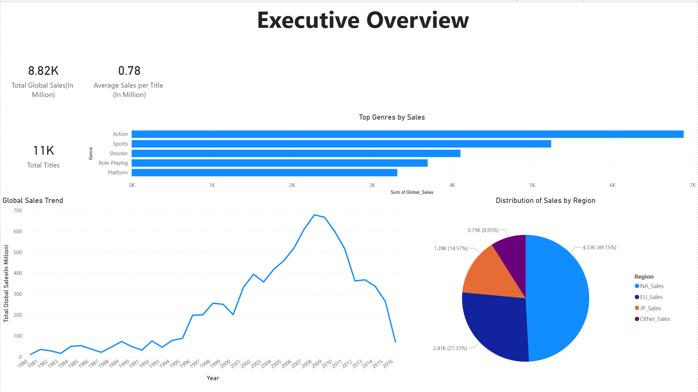

Interactive Power BI dashboard analysing video game sales trends by time, region, genre, platform, and publisher.

**Tools & Techniques**
Data transformation, data analysis expressions, interactive slicers, drill
through, data aggregation, and trend analysis.

**Key Insights**
1)Identified top-performing genres globally as action and sports, and the
North American market as the largest single market with almost 50% of
sales.  
2)Games published after 2008 show a strong downward trend in global
sales.
3)PS3, PS2 and X360 are the three platforms that account for the most
sales globally, in the European Market and in other countries. In North
America, the top performing platforms are X360, PS2, and Wii, and DS,
PS, and PS2 in Japan respectively.
4)The Japanese market declined slower than all other markets, and has a
notably higher share of role-playing games sold.
5)Nintendo has the highest market share by global sales across all time
and genres with 20%
6)Palcom, Mojang, and Bethesda Softwars are not among the top 10
publishers by market share, however they achieved very high average
sales numbers per title that was released.
7)Nintendo’s business performance is led by platform, role-playing, and
sports games, with North America emerging as the company’s primary
market.

**Data Information**
Dataset downloaded from kaggle.com (https://www.kaggle.com/datasets/gregorut/videogamesales/data)

